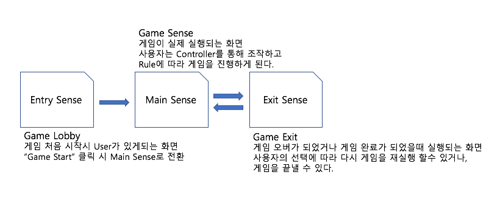
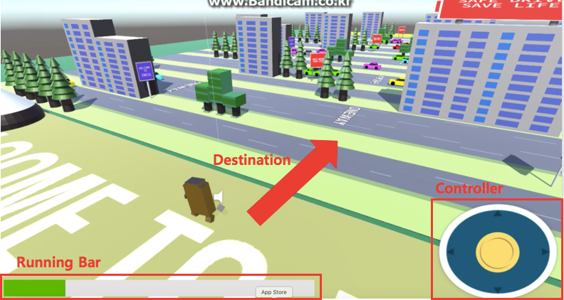
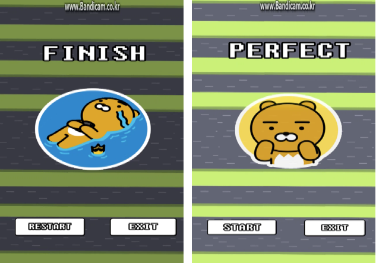

# Unity_CrossKolkata
UnityMobile Game built in ILT in Kolkata, India

----------

# Objective #
 스마트 APP을 통하여 도로 교통 문화에 대한 인식을 개선시킨다.

# Constraints 
> IOS, Android 환경에서 실행 될 수 있는 App형태여야 한다.
>
> **설계 사양**:  ios 7 이상 환경, Android 환경, 200MB이하 

 

# Solution

> ##**모바일 게임 APP을 통해서 현지 교통상황을 인식할 수 있게 한다.** 
>
> 1. 모바일 게임 배경은 콜카타에서 볼 수 있는 차량(TAXI, BUS, 승용차 등)들과 도로 신호, 표지판 들로 하여 현지 교통을 반영했다는 것을 인식할 수 있게 한다. 
> 2. 차들의 자유로운 차선 변경, 무작위 한 차들의 속도 등을 게임에 반영하여 더욱 현실감을 높인다. 
> 3. 메인 character의 목숨(life)을 한 개 로 하여 사람의 생명이 단 하나임을 나타낸다. 
> 
>## **교통문화를 게임을 통해 가볍게 즐기면서 배울 수 있게 한다**.
> 
> 1. 현실적 사람이 아니라 character 를 사용자가 조작하게 하여 게임을 즐길 수 있게 한다. 
> 2. 도로 교통상황을 반영한 많은 차들의 경적 소리와 차량들이 있지만 경쾌한 배경음악을 삽입하여 심각하지 않게 하고 재미를 더한다.

 
 

# Implimentation Structure 
> 

> **1. Entry Sense**
>
>- 대부분의 게임에서 제공하는 Lobby 기능을 담당하는 Sense
>
>- 게임을 실행하기 전 사용자를 준비 상태에 있게 하며 사용자의 시작 버튼으로 게임을 실행하게 한다. 
>
>**2. Main Sense**
>
>- 게임이 시작되는 Sense.
>- 사용자가 controller를 통해 캐릭터를 조작 
>- 게임 오버 또는 게임 완료를 다음 Sense을 넘어가기 위한 변수로 전달  
> 
>**3.Exit Sense**
> 
>- 사용자가 게임의 결과에 따라 다른 구성을 보이는 Sense.
>
>- 게임을 다시 시작하거나 close시킬 수 있는 기능을 가지고 있다. 
>  

 
# Game UI 
## Game Sense

> 1. **RunnigBar **
> 시간이 지남에 따라 게이지가 차고 다 찼을 때, Character가 일정 시간동안 이동 속도가 빨라진다. 
> 2. **Controller **
> 사용자가 터치와 드래그로 Character의 방향과 속도를 조작 
> 3. **Destination **
> 게임이 clear할 수 있는 방향. 차량에 치이지 않고 도착하는 것이 관건 
## Exit Sense

>
 
----------

# Function List 

><b> 1. object pool 생성 </b> 
><b> 2. Conditional Sense load </b> 
><b> 3. Object Dynamic generation/delete  </b> 
><b> 4. Character Controller </b> 
><b> 5. Game Manager  </b> 

 

